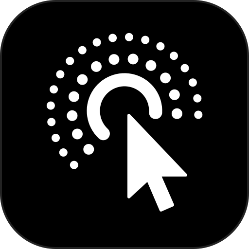

<div align="center">



# Cluadex

**A lightweight LCU, for Claude Code only.**<br>
Codex computer use as a plugin. Two commands to install, about 800 lines, nothing else to set up.

[](#install)
[](https://github.com/leepokai/cluadex/commits/main)
[](LICENSE)
[](https://github.com/amontlabs/lcu)
<br>


</div>

[LCU](https://github.com/amontlabs/lcu) takes Codex's computer use out of the Codex app and brings it to five agent harnesses, on macOS and Linux. Cluadex is that idea cut down to a single case: Claude Code on a Mac, installed the way every other Claude Code plugin is.

It is an independent reimplementation, not a fork, and shares no code with LCU. The name is Claude + CUA + Codex: Claude using Codex's computer-use agent (CUA) runtime.

## Install

```sh
claude plugin marketplace add leepokai/cluadex
claude plugin install cluadex@cluadex
```

That is the whole setup. There is no installer script, no Python and no npm, and updates and removal go through Claude Code's own plugin manager. Then ask for something in a desktop app, for example "use computer use to read the Calculator window".

An installed plugin loads in every session, and each session holds 3 processes (about 120 MB) while idle and 7 (about 320 MB) once computer use has run. To load it only when you want it, clone the repo and pass it per session instead:

```sh
git clone https://github.com/leepokai/cluadex
claude --plugin-dir ./cluadex
```

## Lightweight by leaving things out

| | LCU 0.9.2 | Cluadex |
| --- | --- | --- |
| Agent harnesses | Pi, Codex CLI, Claude Code, Oh My Pi, Hermes | Claude Code |
| Platforms | macOS and Linux, Windows as a candidate | macOS on Apple Silicon |
| Install | Release archive and installer, needs Python 3.12+ | Two `claude plugin` commands |
| Update and removal | `lcu update`, manual removal steps | Claude Code's plugin manager |
| Code, without tests | about 11,400 lines | about 800 lines |
| Chrome control, audio recording | Opt-in | Not included |
| Managing the always-allowed list | `lcu apps`, behind Touch ID | Edit one file |

If you need Linux, another harness or Chrome, use LCU. Line counts were taken on 2026-10-05.

## What it does

The ChatGPT desktop app ships a computer-use MCP server. This plugin starts that server, unchanged, and offers its computer-use functions to Claude Code as ordinary tools. It adds only what a host other than Codex lacks:

- **Approval panel.** The first time the agent touches an app, a Liquid Glass panel asks "Allow computer use to control …?". Only the person at the Mac can answer; the model cannot see or press it.
- **Turn cleanup.** Hooks tell the runtime when a turn ends.
- **Host guard.** The app hosting the agent (Claude, your terminal) is never approved, so the agent cannot click its own permission prompts.

It contains no computer-use logic and no OpenAI files. This is an unofficial project, not affiliated with OpenAI or Anthropic.

## Tools

| Tool | What it does |
| --- | --- |
| `list_apps` | Lists the apps computer use can work with. |
| `get_app_state` | Reads an app's key window as numbered accessibility text, with an optional screenshot. |
| `click` | Clicks an element by index, or a point. |
| `type_text` | Types text into the focused field. |
| `press_key` | Presses a key or combination. |
| `set_value` | Sets a text field, slider or other settable element. |
| `select_text` | Selects text, or places the cursor next to it. |
| `paste` | Pastes plain, Markdown or HTML text and restores the clipboard. |
| `scroll` | Scrolls an element or the view at a point. |
| `drag` | Drags from one point to another. |
| `perform_secondary_action` | Runs an element's secondary accessibility action. |

The first two only read. Every other named tool returns the app's state after it acts, so there is no need to read again before the next step. Because each action is its own tool, Claude Code's permission rules can allow reading while still asking before clicks.

Each tool is turned into one call to the runtime's own JavaScript tool. Nothing about computer use is reimplemented here.

The runtime's JavaScript tools (`js`, `js_reset`) are not offered by default: they run arbitrary code, and their manual costs about 3,300 tokens at the start of every session. With them hidden, the plugin drops that manual from the runtime's first answer and keeps its confirmation policy. Set `CLUADEX_JS=1` to get them back, for chaining several actions in one call.

## Requirements

- Apple Silicon Mac with the [ChatGPT desktop app](https://chatgpt.com/download/) at `/Applications/ChatGPT.app`, with Computer Use already working in Codex (Accessibility and Screen Recording granted).
- Claude Code.
- macOS 26 or newer for the Liquid Glass panel. Older systems get a plain list dialog instead.

There is nothing else to install. The relay runs on the Node bundled inside the ChatGPT app.

## Approvals

The choices and their meaning are OpenAI's. Every one of them covers only the app being asked about.

| Choice | Effect |
| --- | --- |
| Allow this conversation | That app, until this Claude Code session ends. |
| Always allow | That app, permanently. Remembered by OpenAI's runtime, so the Codex app stops asking too. |
| Deny | Also what happens when nobody answers within 120 seconds. |

A different app always gets its own question. When the runtime offers no conversation scope, the first choice becomes "Allow once". Apps the runtime marks high risk, such as browsers, show its warning.

The panel does not take the keyboard, so nothing you are typing can answer it. Only a click approves.

"Always allow" is stored in `~/Library/Group Containers/2DC432GLL2.com.openai.sky.CUAService/Library/Application Support/Software/ComputerUseAppApprovals.json`. Remove a line there to take an approval back.

| Environment variable | Effect |
| --- | --- |
| `CLUADEX_APPROVAL=deny` | Decline every request without a prompt, for unattended runs. There is no setting that approves automatically. |
| `CLUADEX_PLAIN_PROMPT=1` | Use the plain list dialog instead of the panel. |
| `CLUADEX_JS=1` | Also offer the runtime's `js` and `js_reset` tools. |
| `CLUADEX_APP=/path/to/ChatGPT.app` | Use an app outside `/Applications` (also change the Node path in `.mcp.json`). |

## The approval panel binary

`bin/approve-ui` is built from `ui/ApprovalPanel.swift` and committed so the plugin works without Xcode. It only draws the panel and prints the choice; `relay.mjs` decides what that means. To build it yourself:

```sh
./build.sh
```

## Run from a clone

To change the code and have it take effect straight away, skip the plugin and register a clone as a user MCP server:

```sh
git clone https://github.com/leepokai/cluadex ~/cluadex
claude mcp add --scope user cluadex -- /Applications/ChatGPT.app/Contents/Resources/cua_node/bin/node ~/cluadex/relay.mjs
```

Turn cleanup comes from two hooks, which the plugin would otherwise bring. Add them to `~/.claude/settings.json`:

```json
{
  "hooks": {
    "Stop": [
      { "hooks": [{ "type": "command", "command": "sh \"$HOME/cluadex/hooks/turn-end.sh\" Stop 2>/dev/null || true", "timeout": 5 }] }
    ],
    "UserPromptSubmit": [
      { "hooks": [{ "type": "command", "command": "sh \"$HOME/cluadex/hooks/turn-end.sh\" Interrupt 2>/dev/null || true", "timeout": 5 }] }
    ]
  }
}
```

The tools are then named `mcp__cluadex__click` and so on, and the server is listed under your user MCP servers.

- A change to `relay.mjs` applies the next time the server starts: reconnect it from `/mcp`, or open a new session.
- A change to `hooks/turn-end.sh` applies at once.
- After changing `ui/ApprovalPanel.swift`, run `./build.sh`.

Do not install the plugin as well. Two copies in one session would compete for the same socket.

## Checks

```sh
NODE=/Applications/ChatGPT.app/Contents/Resources/cua_node/bin/node
$NODE relay.mjs --selftest   # approval and guard logic, no desktop needed
$NODE relay.mjs --check      # starts the real runtime, lists apps, compares its functions with the tools
```

Run `--check` after the ChatGPT app updates. This plugin depends on the app's internal layout, which OpenAI can change in any release. The check also reads the runtime's own list of computer-use functions: it fails if one of the tools has lost its function, and says so if the runtime has gained one the plugin does not offer.

On macOS the runtime has exactly the eleven functions listed above. Its documentation also describes window listing, app launching and scrolling by pixels, which the macOS runtime does not provide, and a browser tab API, which needs the Chrome surface this plugin leaves off.

## How it works

```
Claude Code ── MCP ── relay.mjs ── MCP ── cua-repl (OpenAI) ── Sky helper (OpenAI) ── your apps
                         ▲
        hooks/turn-end.sh (Stop, UserPromptSubmit) via a local socket
```

`relay.mjs` verifies that the app's Node, `node_repl` and helper are signed by OpenAI, starts the app's own launcher, and forwards MCP messages. It hides the two host-only tools, answers the runtime's approval requests by showing the panel, and stamps each call with a turn id. The hooks reach the relay through `~/Library/Caches/cluadex/<claude pid>.sock`, which accepts one message: the turn is over.

## Limits

- Tested on one machine: ChatGPT app 26.924.22138, Claude Code 2.1.289, macOS 27 on Apple Silicon.
- Native apps only. The Chrome surface is not enabled.
- A turn interrupted with Esc is cleaned up at the next prompt, not at once.
- Subagent calls share the parent turn.
- The host guard matches bundle ids, names and paths by spelling.
- Clicking or dragging by x and y needs the window on stage. With Stage Manager on, a parked window is only a thumbnail and the runtime answers `windowNotFoundAtPosition`; acting by element index works either way. Because of that, point clicks and drags are untested here.
- The runtime waited 45 seconds for an approval answer in testing; the full 120 seconds is untested.
- The plain list dialog has been shown and timed out in testing, but never answered. Esc-to-deny on the panel is written but untested.

## Remove

```sh
claude plugin uninstall cluadex@cluadex
claude plugin marketplace remove cluadex
rm -rf ~/Library/Caches/cluadex
```

To also forget approvals, edit the "Always allow" file above.

## Credit

The approach of reusing the installed runtime, and the host-guard idea, come from [LCU](https://github.com/amontlabs/lcu). The runtime itself belongs to OpenAI and stays under its terms.
